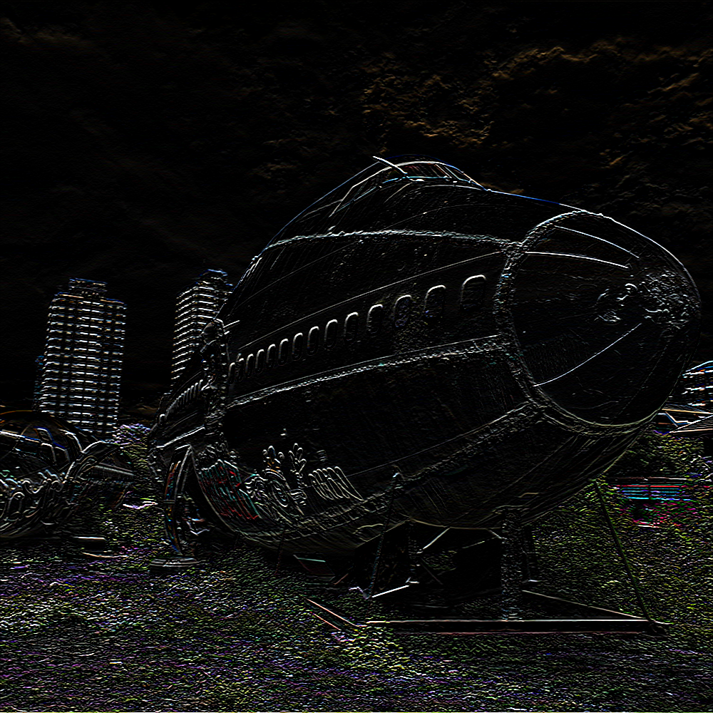

# Image Convolution in VHDL

This project aims to design and implement an Image Convolution system in VHDL, providing a flexible and modular architecture for performing convolution operations on image data. Image convolution is a fundamental operation in image processing and computer vision, used extensively in tasks like feature extraction and filtering. By leveraging distinct algorithms for different processing units, this implementation explores a novel approach to enhancing convolution efficiency and modularity.  

---

### Components 

1. **Instruction Decoder**  
   The decoder is responsible for interpreting instructions and decoding them into opcodes that determine the kernel to use for the convolution process. It also generates an `address_flag` signal to direct the input data to the appropriate computation unit, either the ALU or MMU. This synchronous design ensures proper synchronization with the system clock, allowing the decoder to efficiently coordinate between the components.

2. **Arithmetic Logic Unit (ALU)**  
   The ALU performs convolution using the *direct convolution* method. This approach processes each kernel and pixel operation sequentially, ensuring high precision and straightforward computation. The ALU is designed to handle smaller kernel sizes efficiently, making it suitable for scenarios requiring precise and localized operations.

3. **Matrix Multiplier Unit (MMU)**  
   The MMU employs the *im2col convolution* method, which transforms image data into matrix form, enabling more efficient matrix multiplication for larger kernels. This technique is optimized for scenarios where throughput and scalability are critical. The MMU's design focuses on optimizing matrix operations for speed and resource utilization.

4. **Central Processing Unit (CPU)**  
   The CPU, the top-level design, integrates all components, including the decoder, ALU, and MMU, into a cohesive system. The decoder's control signals guide data routing and kernel selection, while the ALU and MMU handle the core convolution operations. This architecture ensures modularity and scalability, allowing easy integration into broader VHDL-based systems.

---

### Instruction Mapping

| Instruction | Description |
| --- | --- |
| 0000 | box blur kernel with ALU |
| 0001 | horizontal edge detection kernel with ALU |
| 0010 | vertical edge detection kernel with ALU |
| 0011 | laplacian kernel with ALU |
| 0100 | sharpening kernel with ALU |
| 0101 | sobel horizontal kernel with ALU |
| 0110 | sobel vertical kernel with ALU |
| 0111 | custom kernel with ALU |
| 1000 | box blur kernel with MMU |
| 1001 | horizontal edge detection kernel with MMU |
| 1010 | vertical edge detection kernel with MMU |
| 1011 | laplacian kernel with MMU |
| 1100 | sharpening kernel with MMU |
| 1101 | sobel horizontal kernel with MMU |
| 1110 | sobel vertical kernel with MMU |
| 1111 | custom kernel with MMU |

---

### Implementation of Each Module

1. **Dataflow Style**  
   - **Objective**: Design the Decoder and CPU.  
   - **Explanation**: The decoder and CPU are implemented using the dataflow style, where operations execute as soon as their inputs are available. This enables continuous computation and efficient resource usage. The dataflow architecture also ensures a streamlined design for the direct convolution process.  

2. **Behavioral Style**  
   - **Objective**: Implement the ALU and MMU.  
   - **Explanation**: The ALU dan MMU are designed using the behavioral style, focusing on describing the functionality rather than the internal structure. This approach simplifies the implementation of image convolution.  

3. **Structural Style**  
   - **Objective**: Design the top-level integration of the system.  
   - **Explanation**: The structural style defines the interconnections between components, such as the decoder, ALU, and MMU. This explicit definition of structure enhances modularity and maintainability, allowing for easier debugging and future modifications.  

4. **Looping**  
   - **Objective**: Implement kernel sliding and image patching using loops.  
   - **Explanation**: Loop structures are utilized to iterate over image data for kernel application. This approach simplifies repetitive tasks, such as shifting the kernel across the image, making the code concise and readable.   

5. **FSM (Finite State Machine)**  
   - **Objective**: Implement the top-level control logic as an FSM.  
   - **Explanation**: The FSM controls the sequence of operations, transitioning through states such as `IDLE`, `FETCH`, `DECODE`, `EXECUTE`, and `COMPLETE`. Each state corresponds to a specific stage of the convolution process, ensuring orderly and efficient execution.  

6. **Microprogramming**  
   - **Objective**: Implement a top-level control unit for flexible convolution parameterization.  
   - **Explanation**: The central processing unit utilizes control words specifying kernel parameters and operation mode (ALU or MMU). This compact format facilitates flexible and efficient control of the convolution process.  

---

### Waveform Simulation

### Results

| Description | Image |
| --- | --- |
| Original |  |
| Box Blur |  |
| Horizontal Edge Detection |  |
| Vertical Edge Detection |  |
| Laplacian |  |
| Sharpening |  |
| Sobel Horizontal |  |
| Sobel Vertical |  |
| Custom |  |